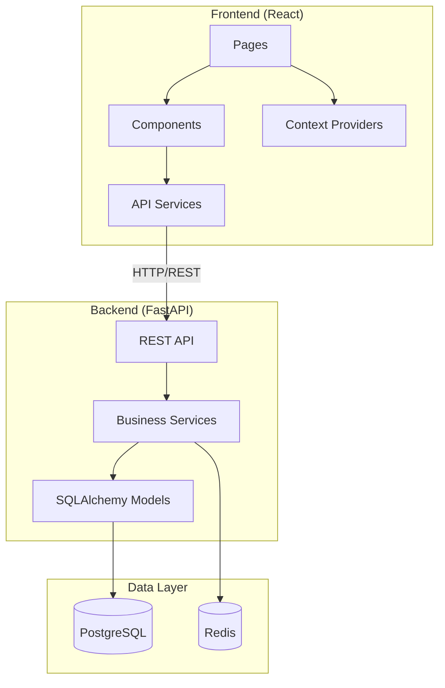
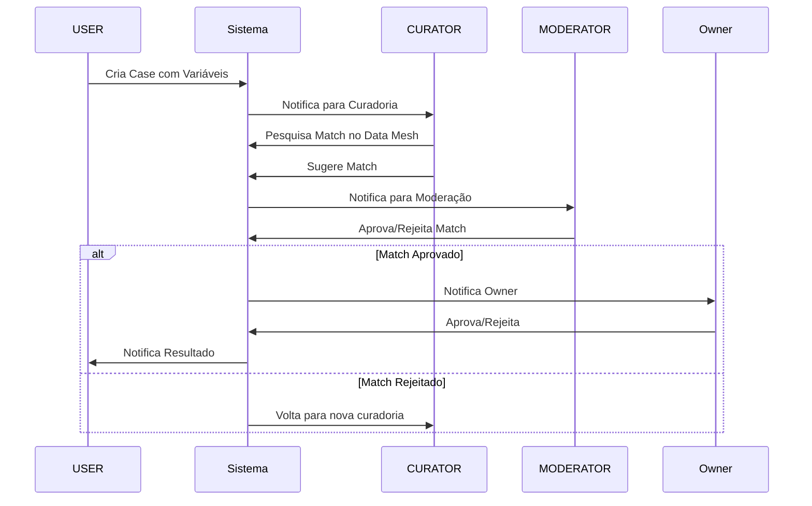

# Arquitetura do Sistema

## Visão Geral

O sistema Gestão Cases 2.0 é uma aplicação web full-stack para gerenciamento do ciclo de vida de projetos de consultoria.

---

## Stack Tecnológica

| Camada    | Tecnologia                   |
| --------- | ---------------------------- |
| Frontend  | React 18 + TypeScript + Vite |
| Backend   | FastAPI (Python 3.11)        |
| Database  | PostgreSQL 15                |
| Cache     | Redis                        |
| Container | Docker & Docker Compose      |

---

## Diagrama de Componentes



---

## Fluxo de Aprovação de Variáveis



---

## Roles do Sistema

| Role          | Responsabilidades                                 |
| ------------- | ------------------------------------------------- |
| **USER**      | Cria cases, gerencia variáveis, visualiza status  |
| **CURATOR**   | Pesquisa matches no Data Mesh, sugere associações |
| **MODERATOR** | Aprova/rejeita matches, supervisiona curadoria    |
| **ADMIN**     | Gerencia usuários, configurações, hierarquias     |

---

## Estrutura de Diretórios

### Frontend

```
frontend/src/
├── components/
│   ├── admin/        # SystemConfigPanel, UserManagement, etc.
│   ├── cases/        # CaseCard, MatchSelector, ReviewPanels
│   │   └── tabs/     # OverviewTab, DocumentsTab, HistoryTab, etc.
│   ├── charts/       # ActivityHeatmap, CaseBarChart
│   ├── common/       # Toast, Modal, StickyFooter
│   └── moderation/   # ModerationCard, ModerationResponseModal
├── pages/            # Dashboard, CaseDetail, PendingReviews, etc.
├── services/         # caseService, moderationService, matchingService
├── types/            # TypeScript interfaces (variables, history)
└── context/          # AuthContext, ThemeProvider
```

### Backend

```
backend/app/
├── api/              # REST endpoints (/cases, /users, /moderation)
├── core/             # Config, security, exceptions
├── models/           # User, Case, CaseVariable, Match, etc.
├── schemas/          # Pydantic request/response schemas
└── services/         # BusinessLogic, NotificationService, AuditService
```

---

## Integração com Data Mesh

O sistema se integra com o Data Mesh para buscar variáveis compatíveis:

1. **Curador** pesquisa variáveis no Data Mesh via interface
2. **Sistema** retorna matches com score de compatibilidade
3. **Curador** seleciona melhor match
4. **Moderador** valida a seleção
5. **Owner** aprova o uso da variável

---

## Docker Compose

| Arquivo                    | Uso                       |
| -------------------------- | ------------------------- |
| `docker-compose.yml`       | Desenvolvimento padrão    |
| `docker-compose.build.yml` | Build limpo (sem volumes) |
| `docker-compose.test.yml`  | Ambiente de testes        |
